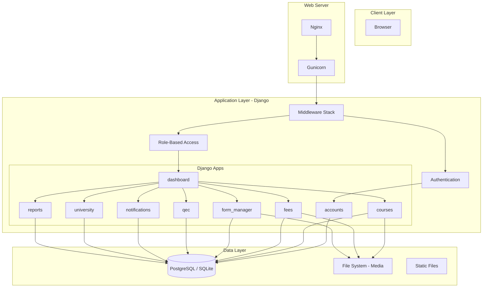
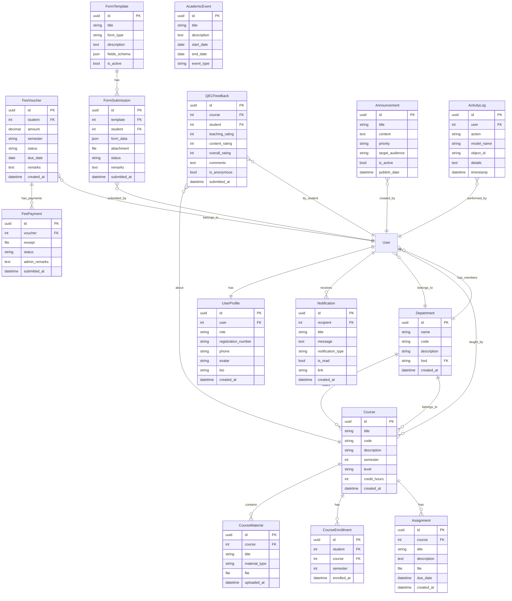

# UAF Smart Dashboard System — Implementation Plan

## Overview

Build a **production-quality university management dashboard** for the University of Agriculture Faisalabad (UAF), combining Undergraduate and Postgraduate dashboard proposals into one unified SaaS-like platform.

**Tech Stack**: Django 5.x · Django Templates · Tailwind CSS · Alpine.js · Chart.js · PostgreSQL/SQLite · Docker

---

## Environment Assessment

| Tool | Status |
|------|--------|
| Python | 3.12.3 ✅ |
| pip | 24.0 ✅ |
| Node.js | v22.17.1 ✅ (for Tailwind CLI) |
| PostgreSQL | ❌ Not installed — will use **SQLite** for local dev |
| Django | Not installed — will install in virtualenv |

---

## User Review Required

> [!IMPORTANT]
> **SQLite for Local Development**: PostgreSQL is not installed on your system. The project will use SQLite for local development and include Docker + PostgreSQL configuration for production deployment. Is this acceptable?

> [!IMPORTANT]
> **Phased Delivery**: This is an extremely large project (~15,000+ lines of code across 100+ files). I will build it in **6 phases**, delivering a working application after each phase. Each phase builds on the previous one. Do you want me to proceed with all phases sequentially, or pause for review between phases?

> [!WARNING]
> **Tailwind CSS Setup**: I will use Tailwind CSS v3 via the standalone CLI (no npm required for Tailwind itself — just downloading the binary). Node.js will be used for the `npx tailwindcss` command. This keeps the setup simple.

---

## Open Questions

1. **Email Backend**: Should I configure a real SMTP backend (e.g., Gmail) for password reset emails, or use Django's console email backend for development?
2. **Sample Data**: The seed data will include demo users with simple passwords (e.g., `password123`). These are for development only. Confirmed?
3. **Deployment Target**: Is Docker + docker-compose sufficient, or do you also need specific AWS/DigitalOcean deployment scripts?

---

## Architecture Overview



---

## Database Schema (ERD)



---

## Project Structure

```
university_uaf_dashboard/
├── manage.py
├── requirements.txt
├── README.md
├── .env.example
├── .gitignore
├── docker-compose.yml
├── Dockerfile
├── nginx/
│   └── nginx.conf
├── config/                          # Django project settings
│   ├── __init__.py
│   ├── settings/
│   │   ├── __init__.py
│   │   ├── base.py                  # Shared settings
│   │   ├── development.py           # SQLite, DEBUG=True
│   │   └── production.py            # PostgreSQL, DEBUG=False
│   ├── urls.py                      # Root URL config
│   ├── wsgi.py
│   └── asgi.py
├── apps/
│   ├── __init__.py
│   ├── accounts/                    # Custom user, auth, profiles
│   │   ├── models.py
│   │   ├── views.py
│   │   ├── forms.py
│   │   ├── decorators.py            # Role-based decorators
│   │   ├── signals.py
│   │   ├── admin.py
│   │   ├── urls.py
│   │   ├── managers.py              # Custom user manager
│   │   └── middleware.py
│   ├── dashboard/                   # Role-based dashboards
│   │   ├── views.py
│   │   ├── urls.py
│   │   └── templatetags/
│   │       └── dashboard_tags.py
│   ├── courses/                     # Course management
│   │   ├── models.py
│   │   ├── views.py
│   │   ├── forms.py
│   │   ├── urls.py
│   │   └── admin.py
│   ├── fees/                        # Fee voucher system
│   │   ├── models.py
│   │   ├── views.py
│   │   ├── forms.py
│   │   ├── urls.py
│   │   └── admin.py
│   ├── form_manager/                # UG/PG forms
│   │   ├── models.py
│   │   ├── views.py
│   │   ├── forms.py
│   │   ├── urls.py
│   │   └── admin.py
│   ├── qec/                         # Quality Enhancement Cell
│   │   ├── models.py
│   │   ├── views.py
│   │   ├── forms.py
│   │   ├── urls.py
│   │   └── admin.py
│   ├── notifications/               # In-app notifications
│   │   ├── models.py
│   │   ├── views.py
│   │   ├── urls.py
│   │   ├── signals.py
│   │   └── context_processors.py
│   ├── university/                  # Calendar, events, directory
│   │   ├── models.py
│   │   ├── views.py
│   │   ├── urls.py
│   │   └── admin.py
│   └── reports/                     # Analytics & exports
│       ├── views.py
│       ├── urls.py
│       └── utils.py                 # PDF/CSV/Excel generators
├── templates/
│   ├── base.html                    # Master template
│   ├── components/                  # Reusable UI components
│   │   ├── sidebar.html
│   │   ├── navbar.html
│   │   ├── footer.html
│   │   ├── modal.html
│   │   ├── toast.html
│   │   ├── pagination.html
│   │   ├── breadcrumbs.html
│   │   ├── empty_state.html
│   │   ├── loading.html
│   │   ├── search_bar.html
│   │   └── stats_card.html
│   ├── landing/                     # Public website
│   │   ├── home.html
│   │   ├── about.html
│   │   ├── features.html
│   │   ├── departments.html
│   │   ├── faculty.html
│   │   ├── contact.html
│   │   └── announcements.html
│   ├── accounts/                    # Auth templates
│   │   ├── login.html
│   │   ├── register.html
│   │   ├── forgot_password.html
│   │   ├── reset_password.html
│   │   ├── change_password.html
│   │   └── profile.html
│   ├── dashboard/                   # Dashboard templates
│   │   ├── admin_dashboard.html
│   │   ├── faculty_dashboard.html
│   │   ├── student_dashboard.html
│   │   └── qec_dashboard.html
│   ├── courses/
│   ├── fees/
│   ├── forms/
│   ├── qec/
│   ├── notifications/
│   ├── university/
│   └── reports/
├── static/
│   ├── css/
│   │   ├── input.css                # Tailwind input
│   │   └── output.css               # Compiled Tailwind
│   ├── js/
│   │   ├── main.js                  # Global JS
│   │   ├── sidebar.js
│   │   ├── notifications.js
│   │   ├── search.js
│   │   ├── charts.js
│   │   └── modals.js
│   └── images/
│       ├── logo.png
│       └── favicon.ico
├── media/                           # User uploads
│   ├── vouchers/
│   ├── forms/
│   ├── course_materials/
│   ├── qec_feedback/
│   └── avatars/
├── fixtures/
│   └── seed_data.json
└── management/
    └── commands/
        └── seed_db.py               # Custom seed command
```

---

## Proposed Changes — Phased Development

### Phase 1: Foundation & Authentication (Core Infrastructure)

Sets up the Django project, custom user model, role-based auth, and base templates.

#### [NEW] config/ — Django Project Configuration

- `config/settings/base.py` — Shared Django settings (installed apps, middleware, templates, static/media, auth user model)
- `config/settings/development.py` — SQLite database, DEBUG=True, console email
- `config/settings/production.py` — PostgreSQL, DEBUG=False, SMTP email, security headers
- `config/urls.py` — Root URL configuration routing to all apps
- `config/wsgi.py`, `config/asgi.py` — WSGI/ASGI entry points

#### [NEW] apps/accounts/ — Custom User & Authentication

- `models.py` — Custom `User` model (AbstractUser) with role field + `UserProfile` model with UUID, department FK, registration number, phone, avatar, bio
- `managers.py` — Custom `UserManager` for registration number or email login
- `forms.py` — LoginForm, RegistrationForm, ProfileForm, ChangePasswordForm, ForgotPasswordForm
- `views.py` — Login, logout, register, profile, change password, forgot/reset password, role-based redirect
- `decorators.py` — `@role_required('admin', 'faculty')` decorator, role mixin classes
- `signals.py` — Auto-create UserProfile on User creation
- `middleware.py` — Role-based access middleware
- `admin.py` — Custom admin for User model
- `urls.py` — Auth URL patterns

#### [NEW] templates/ — Base Templates & Components

- `base.html` — Master layout with Tailwind, Chart.js CDN, Alpine.js, font imports
- `components/sidebar.html` — Responsive sidebar with role-based menu items
- `components/navbar.html` — Top navbar with search, notifications bell, user dropdown
- `components/footer.html`, `modal.html`, `toast.html`, `pagination.html`, `breadcrumbs.html`
- `accounts/*.html` — All auth page templates

#### [NEW] static/ — CSS & JavaScript

- `css/input.css` — Tailwind directives + custom component classes
- `js/main.js` — Toast system, sidebar toggle, Alpine.js initialization
- `js/sidebar.js` — Responsive sidebar behavior
- Tailwind config (`tailwind.config.js`) — Custom UAF theme colors, Inter/Poppins fonts

#### [NEW] Project Root Files

- `manage.py`, `requirements.txt`, `.env.example`, `.gitignore`, `README.md`

---

### Phase 2: Landing Website & Dashboard Framework

#### [NEW] templates/landing/ — Public Website

- `home.html` — Hero section, university intro, statistics counter, feature cards, faculty showcase, testimonials, announcements, footer
- `about.html` — University history, mission, vision, leadership
- `features.html` — Platform feature showcase
- `departments.html` — Department listing with cards
- `faculty.html` — Faculty directory with search/filter
- `contact.html` — Contact form with map placeholder
- `announcements.html` — Public announcements list

#### [NEW] apps/dashboard/ — Role-Based Dashboards

- `views.py` — Dashboard views dispatching to role-specific templates
- `templatetags/dashboard_tags.py` — Custom template tags for stats, charts
- `urls.py` — Dashboard URL patterns

#### [NEW] templates/dashboard/ — Dashboard Templates

- `admin_dashboard.html` — Admin stats: total students, faculty, departments, recent activity, charts
- `faculty_dashboard.html` — My courses, pending assignments, recent submissions, QEC scores
- `student_dashboard.html` — My courses, fee status, form status, announcements, deadlines
- `qec_dashboard.html` — Feedback summaries, rating charts, department analytics

---

### Phase 3: Course Management & University Data

#### [NEW] apps/courses/ — Course Management

- `models.py` — `Course`, `CourseMaterial`, `Assignment`, `CourseEnrollment` models with UUID PKs
- `views.py` — CRUD for courses (faculty), browse/download (students), filter by dept/semester
- `forms.py` — CourseForm, MaterialUploadForm, AssignmentForm
- `urls.py`, `admin.py`

#### [NEW] apps/university/ — University Data

- `models.py` — `Announcement`, `AcademicEvent`, `Department` (extended), `FacultyDirectory`
- `views.py` — Academic calendar, notices, events, department directory, faculty directory
- `urls.py`, `admin.py`

#### [NEW] templates/courses/ & templates/university/

- Course list, detail, create/edit, materials, assignments
- Academic calendar, events, announcements, department pages

---

### Phase 4: Fee Vouchers & Form Management

#### [NEW] apps/fees/ — Fee Voucher System

- `models.py` — `FeeVoucher`, `FeePayment` with status workflow (Pending → Paid → Approved/Rejected)
- `views.py` — Generate vouchers (admin), view/upload receipt (student), approve/reject (admin)
- `forms.py` — VoucherForm, PaymentUploadForm
- `urls.py`, `admin.py`

#### [NEW] apps/form_manager/ — UG & PG Forms

- `models.py` — `FormTemplate`, `FormSubmission` with form_type field (UG/PG), JSON schema for dynamic fields, approval workflow
- `views.py` — Create/submit forms, track status, approval workflow, download submitted PDF
- `forms.py` — DynamicFormRenderer, SubmissionForm
- `urls.py`, `admin.py`

#### [NEW] templates/fees/ & templates/forms/

- Voucher list, detail, upload receipt, admin review
- Form templates list, submit form, track submissions, approval views

---

### Phase 5: QEC, Notifications & Search

#### [NEW] apps/qec/ — Quality Enhancement Cell

- `models.py` — `QECFeedback`, `QECReport` models with rating fields
- `views.py` — Submit feedback (students), view summaries (faculty), analytics dashboard (admin/QEC officer)
- `forms.py` — FeedbackForm with rating widgets
- `urls.py`, `admin.py`

#### [NEW] apps/notifications/ — Notification System

- `models.py` — `Notification` model with type, read status, link
- `views.py` — Notification list, mark read, mark all read
- `signals.py` — Auto-create notifications on key events (voucher approved, form status change, new announcement, assignment deadline)
- `context_processors.py` — Inject unread count into all templates
- `urls.py`

#### [NEW] Global Search

- Search view in `apps/dashboard/views.py` — Searches across students, faculty, courses, forms, notices, vouchers, departments
- `templates/dashboard/search_results.html` — Categorized search results
- `static/js/search.js` — AJAX-powered search with debounce

---

### Phase 6: Reports, Admin Panel, Seed Data & Deployment

#### [NEW] apps/reports/ — Reporting & Analytics

- `views.py` — Analytics dashboard with Chart.js, export endpoints
- `utils.py` — PDF generation (ReportLab or WeasyPrint), CSV export, Excel export (openpyxl)
- `urls.py`
- Reports: Students by department, payment analytics, form submissions, QEC reports, faculty activity

#### [NEW] Admin Panel Enhancement

- Extended admin views in each app's `admin.py`
- `apps/accounts/views.py` — User management, role assignment, activity logs
- `models.py` additions — `ActivityLog` model for audit trail

#### [NEW] Seed Data

- `apps/accounts/management/commands/seed_db.py` — Creates demo data:
  - 1 Super Admin, 1 University Admin, 1 Department Admin
  - 2 Faculty users, 2 UG students, 2 PG students, 1 QEC Officer
  - 3 Departments (Computer Science, Agriculture, Veterinary Sciences)
  - 3 Courses per department with materials
  - Sample vouchers, forms, feedback, notifications

#### [NEW] Deployment Configuration

- `Dockerfile` — Python 3.12, Django app container
- `docker-compose.yml` — Django + PostgreSQL + Nginx services
- `nginx/nginx.conf` — Reverse proxy, static/media serving
- `requirements.txt` — All Python dependencies
- `README.md` — Complete setup, development, and deployment guide

---

## Design System

### Color Palette

| Token | Value | Usage |
|-------|-------|-------|
| Primary | `indigo-600` / `#4F46E5` | Buttons, links, active states |
| Primary Dark | `indigo-700` / `#4338CA` | Hover states |
| Secondary | `slate-600` / `#475569` | Secondary text, borders |
| Background | `slate-50` / `#F8FAFC` | Page background |
| Surface | `white` / `#FFFFFF` | Cards, modals |
| Accent | `emerald-500` / `#10B981` | Success states |
| Warning | `amber-500` / `#F59E0B` | Warning states |
| Danger | `rose-500` / `#F43F5E` | Error states, delete actions |
| Text Primary | `slate-900` / `#0F172A` | Headings |
| Text Secondary | `slate-500` / `#64748B` | Body text |

### Typography

- **Font**: Inter (Google Fonts)
- **Headings**: `font-bold` with `text-slate-900`
- **Body**: `font-normal` with `text-slate-600`
- **Scale**: text-xs through text-4xl

### Component Patterns

- **Cards**: `bg-white rounded-xl shadow-sm border border-slate-200 p-6`
- **Buttons Primary**: `bg-indigo-600 hover:bg-indigo-700 text-white rounded-lg px-4 py-2.5 font-medium transition-all duration-200`
- **Inputs**: `border border-slate-300 rounded-lg px-4 py-2.5 focus:ring-2 focus:ring-indigo-500 focus:border-indigo-500`
- **Tables**: Striped with hover, `divide-y divide-slate-200`
- **Sidebar**: Fixed left, `w-64 bg-slate-900 text-white` with collapsible menu groups

---

## Verification Plan

### Automated Tests

```bash
# Run after each phase
python manage.py test apps/ --verbosity=2

# Check migrations
python manage.py makemigrations --check --dry-run

# Verify no import errors
python manage.py check --deploy
```

### Browser Testing

After each phase, I will:
1. Start the dev server (`python manage.py runserver`)
2. Navigate to all pages in the browser
3. Test role-based login/redirect for each user type
4. Verify responsive layout at mobile/tablet/desktop breakpoints
5. Test form submissions, file uploads, and CRUD operations
6. Capture screenshots of key pages

### Manual Verification

- All 7 user roles can log in and see their role-specific dashboard
- Landing page renders with all sections
- CRUD operations work for courses, vouchers, forms
- File uploads are stored correctly in media folders
- Notifications appear for relevant events
- Charts render with Chart.js
- Search returns categorized results
- Export functions generate PDF/CSV files

---

## Estimated Scope

| Phase | Files | Lines (est.) | Key Deliverables |
|-------|-------|-------------|------------------|
| 1 | ~25 | ~3,000 | Project setup, auth, base templates |
| 2 | ~15 | ~2,500 | Landing website, dashboards |
| 3 | ~15 | ~2,000 | Courses, university data |
| 4 | ~15 | ~2,500 | Fees, forms |
| 5 | ~15 | ~2,000 | QEC, notifications, search |
| 6 | ~15 | ~2,000 | Reports, seed data, Docker |
| **Total** | **~100** | **~14,000** | **Complete application** |
